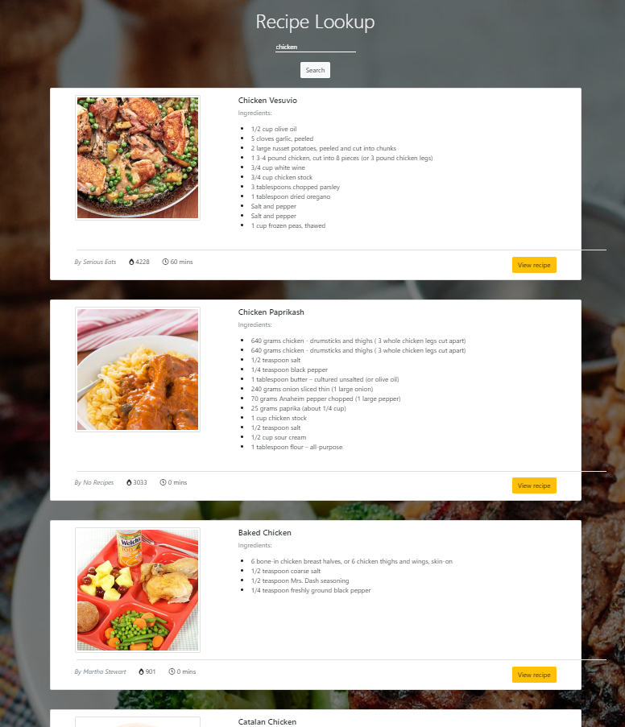

# Recipe Lookup

A recipe search app using React. [Edamam API](https://developer.edamam.com/) is used in this project.

## Installation & Usage

In the project directory, you can run:

 `npm start`

Runs the app in the development mode.\
Open [http://localhost:3000](http://localhost:3000) to view it in the browser.

The page will reload if you make edits.\
You will also see any lint errors in the console.

### Note: You need your own API key and store it in a .env file in the root directory

## Problems
The background carousel won't cover the whole page height when the results are shown on the screen.

## Contributing
Pull requests are welcome. For major changes, please open an issue first to discuss what you would like to change.

Please make sure to update tests as appropriate.

